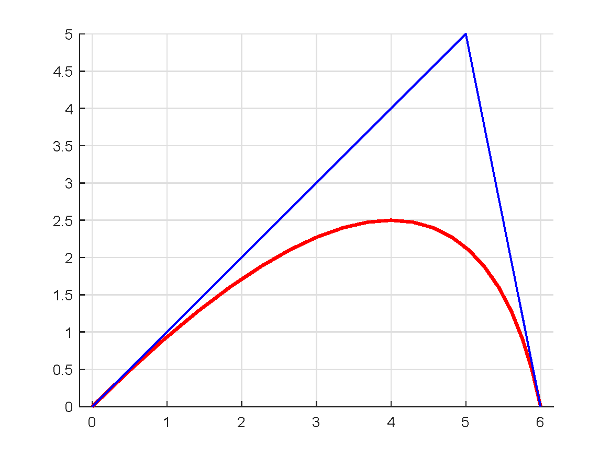
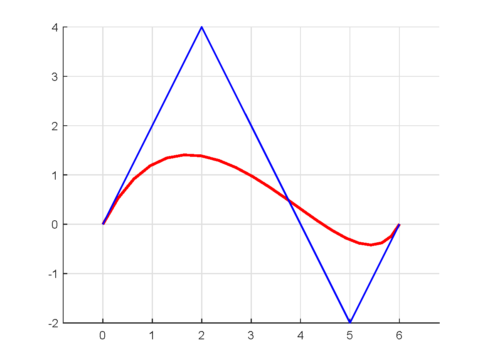
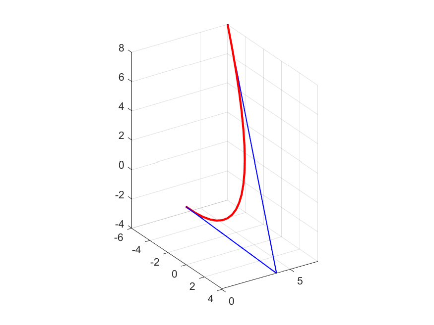
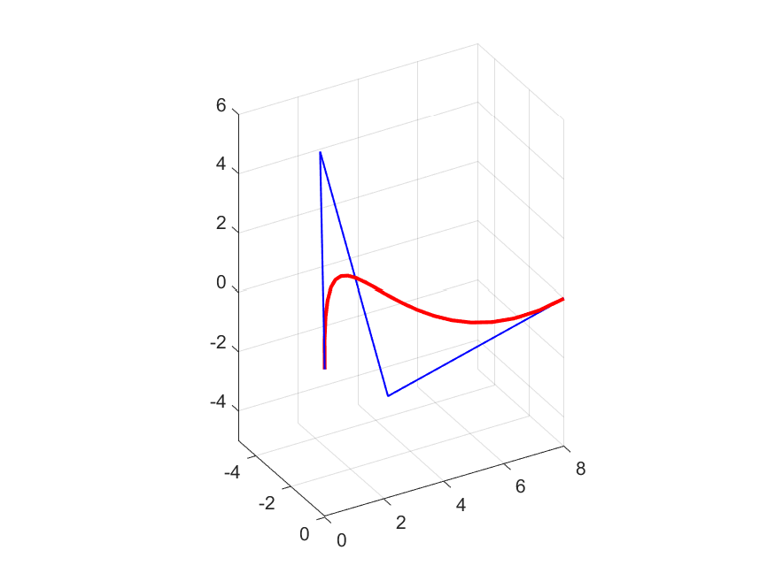

# trajectory planning mathod based on Bezier curve
* This project gives an example, which can be modified by users.    
* Every block during option start and option end should be modified by users according to the actual situation, where contains printing options.   
* Need to pre install dependency `Eigen`:    
  `sudo apt-get install libeigen3-dev`      
  `sudo ln -s /usr/include/eigen3/Eigen /usr/include/Eigen`    
* Provide simple parameter type checking function.      
* Control points should be expressed in a matrix `P_`, each column of this matrix represents a control point given by the users and this matrix should contains the start point at the first column and the end point at the last column.     
* The planning result `Eigen::MatrixXd res` is expressed as a matrix, each column of this matrix represents a point in the trajectory.     
* Four conditions have been tested: `2dim-2order` & `2dim-3order` & `3dim-2order` & `3dim-3order`, the test result is as the follow figures, the period of sampling is set to 0.05, so there is 20 sampling points in the whole process.      
* Reference:    
 [轨迹规划-贝塞尔曲线](https://blog.csdn.net/qq_36458461/article/details/110038462?ops_request_misc=%257B%2522request%255Fid%2522%253A%2522166062603516781790759983%2522%252C%2522scm%2522%253A%252220140713.130102334..%2522%257D&request_id=166062603516781790759983&biz_id=0&utm_medium=distribute.pc_search_result.none-task-blog-2~all~baidu_landing_v2~default-1-110038462-null-null.142^v40^pc_rank_34,185^v2^control&utm_term=%E8%B4%9D%E5%A1%9E%E5%B0%94%E8%BD%A8%E8%BF%B9%E8%A7%84%E5%88%92)      

     

## 2dim-2order 
* Control points are set as `(0, 0)` & `(5, 5)` & `(6, 0)`.    
* All control points are connected with blue solid lines in sequence. 
* Red curve is the planning result.    

  

 

## 2dim-3order  
* Control points are set as `(0, 0)` & `(2, 4)` & `(5, -2)` & `(6, 0)`.    
* All control points are connected with blue solid lines in sequence. 
* Red curve is the planning result.   

  

 

## 3dim-2order 
* Control points are set as `(0, 0, 0)` & `4, 4, -4)` & `(-6, 7, 8)`.    
* All control points are connected with blue solid lines in sequence. 
* Red curve is the planning result.   

  

 

## 3dim-3order     
* Control points are set as `(0, 0, 0)` & `-2, 1, 6)` & `(-5, 5, -5)` & `(0, 8, 0)`.    
* All control points are connected with blue solid lines in sequence. 
* Red curve is the planning result.   

  

